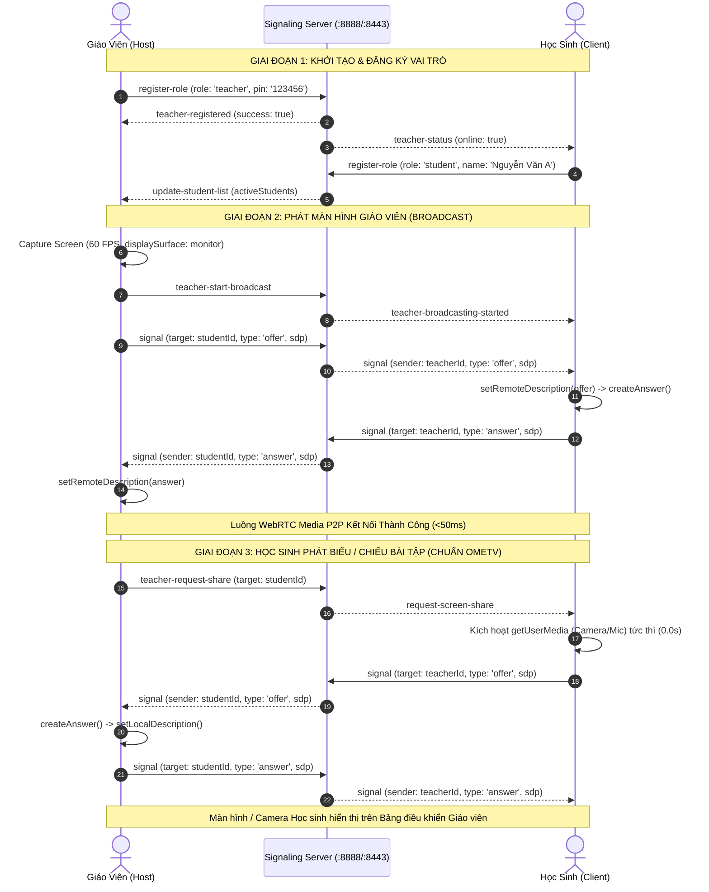

# LanCast Pro — Hệ Thống Trình Chiếu & Tương Tác Lớp Học Mạng LAN (Zero-Cloud WebRTC)

Hệ thống truyền phát màn hình, camera, âm thanh thời gian thực và quản lý lớp học mạng cục bộ (LAN/WLAN) hiệu năng cao. Hoạt động **100% Offline**, **Zero-Cloud Dependency**, độ trễ khung hình **< 50ms**, băng thông nội bộ đạt chuẩn **60 FPS @ 1080p**.

---

## 🏗️ Kiến Trúc Hệ Thống (System Architecture)

```mermaid
graph TD
    subgraph LAN_INFRASTRUCTURE [" Mạng Cục Bộ Nội Bộ (Local Area Network / Wi-Fi) "]
        MDNS["mDNS Zero-Config Engine (lophoc.local)"]
        
        subgraph HOST_SERVER [" Server Chủ Phòng (Node.js Express / Python FastAPI) "]
            HTTP_SRV["HTTP Server (:8888)"]
            HTTPS_SRV["HTTPS SSL Engine (:8443)"]
            SIG_HUB["Socket.IO WebRTC Signaling Engine"]
            ROOM_MGR["In-Memory Room & Queue State Manager"]
            
            HTTP_SRV --- SIG_HUB
            HTTPS_SRV --- SIG_HUB
            SIG_HUB --- ROOM_MGR
        end

        subgraph TEACHER_NODE [" Nút Giáo Viên (Host / Master) "]
            T_UI["React 18 Dashboard + PIN Auth"]
            T_CAP["Screen Capture Engine (60 FPS)"]
            T_PEER["WebRTC Multi-Peer Mesh Broadcaster"]
            T_UI --- T_CAP
            T_UI --- T_PEER
        end

        subgraph STUDENT_NODES [" Nút Học Sinh (Edge Clients) "]
            S1["Học sinh 1 (Desktop / Chrome)"]
            S2["Học sinh 2 (Mobile / Safari iOS)"]
            Sn["Học sinh N (Tablet / Android)"]
        end
    end

    MDNS -.->|Phát hiện IP không cần cấu hình| STUDENT_NODES
    TEACHER_NODE <==>|1. Kênh Điều Khiển & Signaling (WebSocket)| SIG_HUB
    STUDENT_NODES <==>|1. Đăng ký vai trò & Nhận Offer/Answer| SIG_HUB
    
    T_PEER ===>|2. Luồng Video/Audio P2P Direct WebRTC Mesh (<50ms)| S1
    T_PEER ===>|2. Luồng Video/Audio P2P Direct WebRTC Mesh (<50ms)| S2
    T_PEER ===>|2. Luồng Video/Audio P2P Direct WebRTC Mesh (<50ms)| Sn
    
    S1 -.->|3. Camera / Screen Share ngược lại Master| T_PEER
```

---

## 🔄 Sơ Đồ Trình Tự Luồng Tín Hiệu (Signaling & Media Sequence)



---

## 📊 Ma Trận Thông Số Kỹ Thuật (Technical Specification Matrix)

| Hạng Mục | Thông Số Chi Tiết |
| :--- | :--- |
| **Giao Thức Truyền Media** | WebSockets (RFC 6455) + WebRTC Data/Media Channels (RFC 8829, RFC 8831) |
| **Băng Thông Khung Hình** | 1080p @ 30 - 60 FPS (Tối ưu hóa biến thiên Bitrate động 2.5 Mbps - 6.0 Mbps) |
| **Độ Trễ Khung Hình (Latency)** | $\le$ 45ms trong mạng Wi-Fi 5 / Wi-Fi 6 nội bộ |
| **Mã Hóa Âm Thanh / Video** | Opus Audio (48kHz stereo) / VP8, VP9, H.264 Baseline Profile |
| **Định Danh Nút Mạng** | mDNS (Multicast DNS / RFC 6762) qua định danh `lophoc.local` |
| **Bảo Mật Truyền Dẫn** | TLS 1.3 Self-Signed 2048-bit RSA + DTLS-SRTP bắt buộc của WebRTC |
| **Cơ Chế Bộ Nhớ Đệm** | Zero-Disk RAM Memory Pipeline (In-memory State Queue) |

---

## ⚡ Hướng Dẫn Triển Khai (Deployment Guide)

### 1. Yêu Cầu Môi Trường
- **Node.js**: $\ge$ 18.0.0 (Khuyên dùng) **HOẶC** **Python**: $\ge$ 3.9

### 2. Khởi Chạy 1-Click (Tự động tải module & biên dịch)

#### 🪟 Môi trường Windows:
Nhấp đúp chuột vào file:
```cmd
start.bat
```

#### 🍎 Môi trường macOS / Linux:
Cấp quyền và chạy:
```bash
chmod +x start.sh
./start.sh
```
*(Hoặc dùng lệnh tiêu chuẩn: `npm install && npm run build && npm start`)*

---

## 🌐 Danh Mục Cổng Giao Tiếp (Port Allocation)

```text
├── http://localhost:8888/teacher         [Cổng Quản Trị Giáo Viên - Mã PIN: 123456]
├── http://lophoc.local:8888              [Cổng Học Sinh HTTP (mDNS Routing)]
├── http://<LOCAL_IP>:8888                [Cổng Học Sinh HTTP (IP Direct)]
└── https://<LOCAL_IP>:8443               [Cổng Học Sinh HTTPS (Lưu quyền Camera/Mic vĩnh viễn)]
```

---

## 🔒 Cơ Chế Vượt Rào Cản Bảo Mật Trình Duyệt (Secure Context Handling)

Các trình duyệt WebRTC hiện đại (Google Chrome, Apple WebKit/Safari, Microsoft Edge) khóa quyền `getUserMedia` và `getDisplayMedia` trên địa chỉ IP HTTP thường:

1. **Chuẩn HTTPS Cấp Sẵn (Cổng :8443)**: Tự động khởi tạo chứng chỉ SSL nội bộ. Người dùng chỉ cần xác nhận ngoại lệ 1 lần đầu tiên để cấp quyền vĩnh viễn.
2. **Cờ Chrome Tùy Chọn (Cho phòng máy HTTP)**:
   ```text
   chrome://flags/#unsafely-treat-insecure-origin-as-secure
   -> Kích hoạt Enabled và gán URL: http://<IP_MAY_CHU>:8888
   ```

---

## 📦 Hướng Dẫn Đẩy Lên Kho Lưu Trữ (Git Repository)

```bash
# Khởi tạo và liên kết remote
git init
git add .
git commit -m "feat(core): initial production release of LanCast Pro WebRTC system"
git branch -M main
git remote add origin https://github.com/nguyenvannga-tech/tool-BDU.git

# Đẩy lên kho lưu trữ
git push -u origin main --force
```
